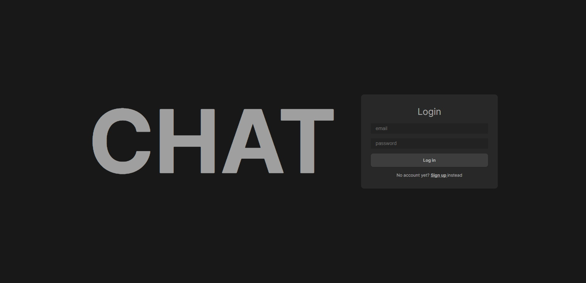
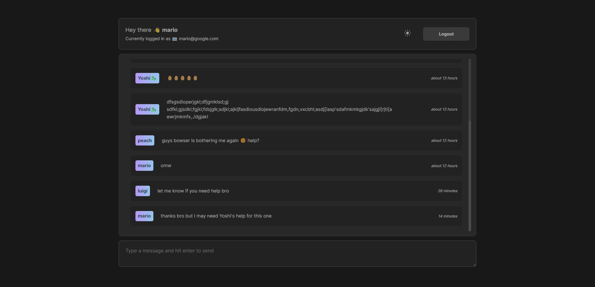
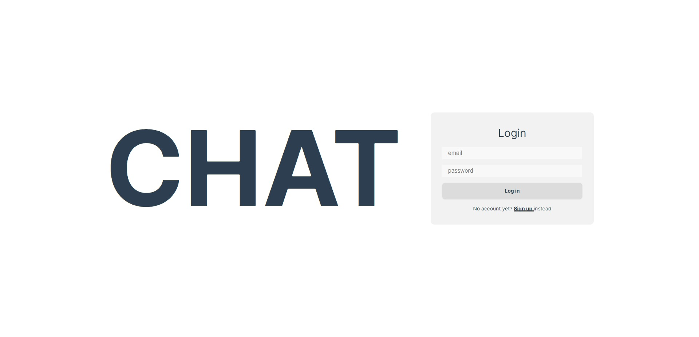
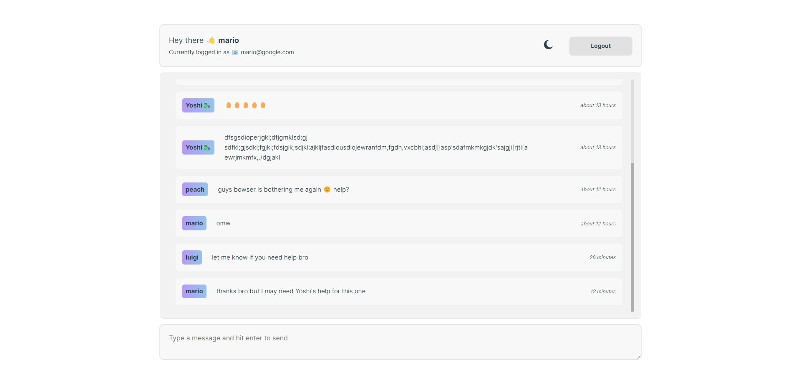

# Overview

The objective is to practice using Vue + Vite by developing live chat application using Firebase

## Feature

- Authentication
- Real-time chat
- Automatically sets the theme mode to users' theme preference
- Toggle light/dark themes

## Demo

[Live Demo👈](https://vue-firebase-4dc0a.web.app/)

# Built with

- Vue 3 & Vite
- Firebase for database, authentication, and hosting
- CSS with Vue themes

# Lessons Learned

- Vue JS
  - Composition API
  - Route guard
  - Using dark mode in Vue JS

- Firebase
  - Connecting Firestore database
  - Using Firebase for authentication
  - Hosting on Firebase
